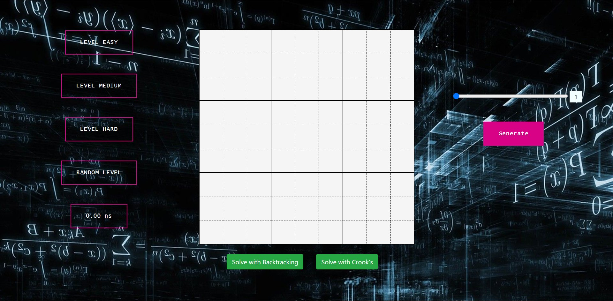
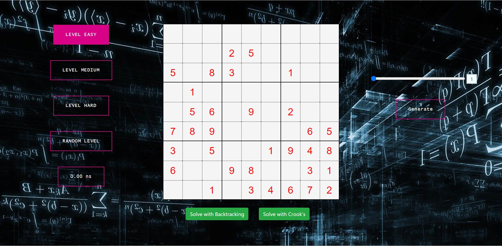
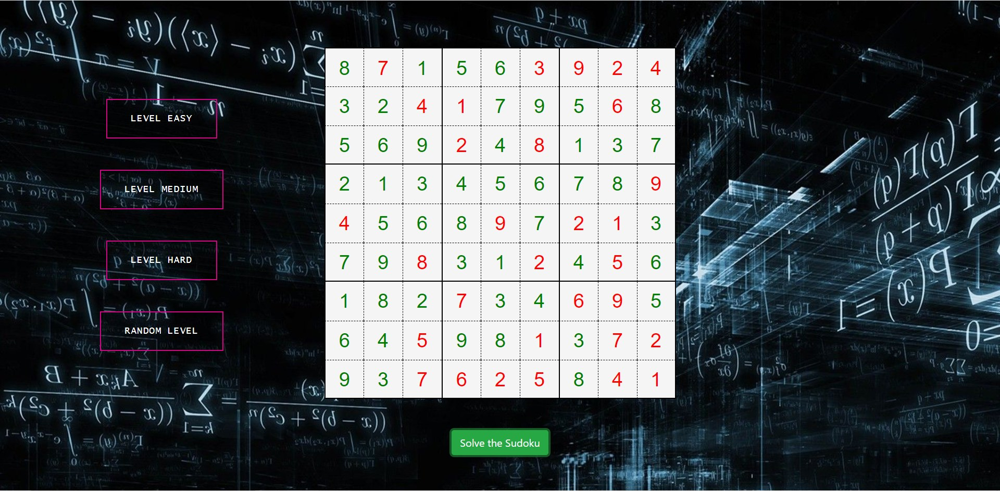
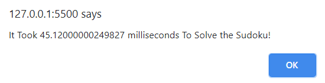
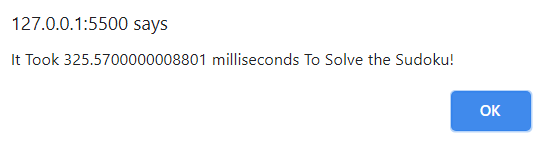
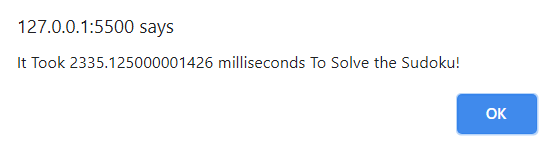

   
  
  <h1>🧩 Sudoku Generator and Solver 🧩</h1>
  <strong>Lets Make Sudoku Solving Easy</strong>

# Sudoku Solver Web App

This Web App Automatically Generates Sudoku Puzzle Based on Various Difficulty Level and Also Informs the Time Taken to Solve Them

### How to run

- Install python and pip
- Run pip install -r requirements.txt
- Run python api.py
- Open index.html

### 🍀 Four Levels 

- Easy Level
- Medium Level
- Hard Level
- Random Level

### ➕ Intial View

  

### 🧩 Generate the Puzzle

> After Clicking the Desired Level of Sudoku Puzzle, Wait for 1-2 Seconds for Sudoku Puzzle to Load

  

### 🤔 Solve the Sudoku Puzzle

> Click on **Solve the Sudoku** Button

  

### ⌚ Time Taken to Solve

> An Alert also Informs Regarding the Time Taken by Sudoku Solver to Solve the Puzzle

- Easy Level

- Medium Level

- Hard Level

## 🤝 Contributing

We encourage you to contribute to Sudoku Solver for Further Improvement! Please check out the [Contributing guide](/CONTRIBUTING.md) for guidelines about how to proceed.